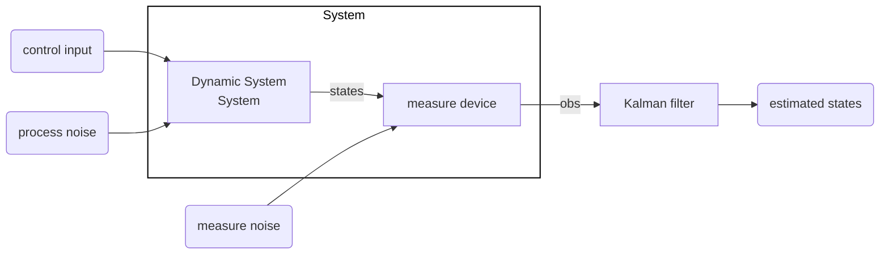

# Kalman Filter
Both measurements and observer outputs are in represented as [[random variables]] to model measurement noise and observer inaccuracy.

We define how *confident* we are in the *model* and *measurements* respectively by defining their [[covariance]].

> [!warning] Only a Locally Converging Filter
> A kalman filter is *not guaratee* a stable output if your initial state is not set correctly. It is not globally converging.

---
#### SSD - State Space
[[State Space Models|State space]] process:
$$
x_{k} = Ax_{k-1} + B u_{k-1} + w_{k-1}
$$

**Driving Noise / Model Error**:
$$
w_{k-1}
$$
Drives the filter to explore new states, even with $u=\vec{0}$.

Shoule be *zero mean* , $\mathbb{E}[w_{k}] = 0$.

We *assume* that the covariance of $w$ is known. Often assumed to be diagonal.
$$
\mathrm{Cov}(w_{k})
\; = \;
Q_{k}
\;
\overset{\mathrm{usually}}{=}
\;
\begin{bmatrix}
\sigma^{2}_{w_{1}} & 0 & 0 \\
0  & \ddots & 0 \\
0 & 0 & \sigma^{2}_{w_{n}}
\end{bmatrix}
$$

Non-gausian noise -> Best *linear* filter
Gausian Noise -> Best *of all* filters

#### Observation
$$
z_{k} = Hx_{k} + v_{k}
$$
**Measurement noise**
For each of our measure, how uncertain are we?
$$
v_{k}
$$
Shoule also have zero mean.

$$
\mathrm{Cov}(v_{k}) = R_{k}
$$
Usually assumed to not be correlated accross measurements, therefore $R_{k}$ is a diagonal matrix with measurement variances for each sensor on the diagonal.

#### Steps
![[Lessons/Semester 7/ssp/Lektion 5 slides.pdf#page=3|Lektion 5 slides]]

---
#### Stages

The Kalman filter works in two **stages**: *Prediction* and *update*. Every step results in a new [[Normalfordelingen|gaussian distribution]].

**Prediction**:
$$
P(X_{t+1}|e_{1:t}) = \int_{x_{t}} 
\;
\underbrace{P(X_{t+1}|x_{t})}_{\mathrm{Transition\ Model}}
\;\;
\underbrace{P(x_{t}|e_{1:t})}_{\mathrm{Current\ Dist.}}
$$

**Update**:
$$
P(X_{t+1}|e_{1:t+1}) =
\alpha
\,
\underbrace{P(e_{t+1}|X_{t+1})}_{\mathrm{New\ Evidence}}
\;
\underbrace{P(X_{t+1}|e_{1:t})}_{\mathrm{Prediction}}
$$

>[!tip]- Nice Slide
>![[lecture7b.pdf#page=10|slide]].

$\hat{x}_{k+1|k}$: The prediction of $x$ at $k+1$ given information at sample $k$.

$K_k$: is the "observer" gain for the Kalman filter.

The **Kalman gain** is defined as
$$
K_{k} = P_{k+1|k} C^{T} (CP_{k+1|k} C^{T} + R_{k})^{-1}
$$

$R_{k}$: Inaccuracy of measurements
$P_{k}$: Inaccuracy of model

---

## Similarities with the Weiner Filter
Under stationary converges to the ideal [[Weiner Filter]], usually the conditions arent stable

**Both**
- Linear Filter
- Minimize [[Mean Square Error (MSE)|MSE]]

**Weiner**
- Requres stationary system ([[WSS]])

**Kalman**
- Uses [[State Space Models]]
- No stationary required

---

## Implementation

> [!tip]- Explaination and Psudocode
> ![[kalman_filter_notes.pdf#page=5]]

---

## Input Properties

The kalman filter is the *ideal filter* given the following requirements:
- Only Linear Systems (in practice not so important)
- Gausian Noise on measurements centered at 0
- Samples must be independent
