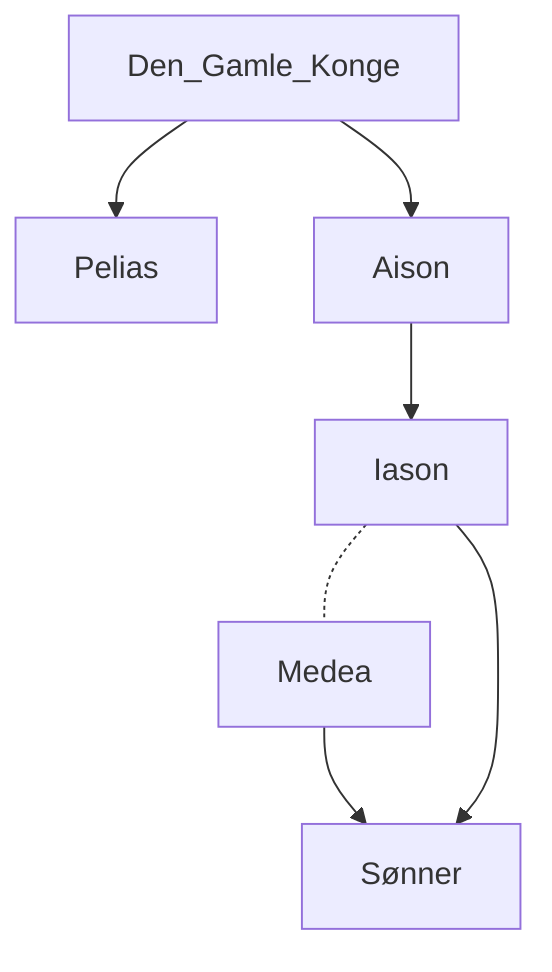

# Sagnet til Medea
---
#### Personer



---
#### Resume


---
```ad-example # Admonition type. See below for a list of available types.
title:                  ##### Tekst
collapse:               # Create a collapsible admonition.

          


I _Iolkos,_ by og borg i Nordgrækenland, var tronen blevet ledig ved kongens død, og to halvbrødre stredes om magten, _Pelias_ og _Aison._ Den første fik overvægten, og fordrev den legitime efterfølger Aison, der måtte skjule sig og sin familie mod Pelias' efterstræbelser.

Det lykkedes Aison at bringe sin søn _Iason_ i sikkerhed og overgive ham til pleje og oplæring hos den viise Kentaur Cheiron. Da Iason er blevet voksen, vender han tilbage til Iolkos og kræver tronen som sin lovlige ret. Pelias svarer ikke rent ud nej, men sætter som betingelse at Iason bringer ham det navnkundige Gyldne Skind som beror i _Kolchis_ fjernt ude i Østen ved Oceanets kyst, der hvor solen står op. Landets konge, _Aietes,_ er søn af Solen, men selv en barsk og dyster skikkelse.

Iason lader da bygge et skib, prægtigere og hurtigere end hidtil set, det lynsnare "_Argo"._

Til togtet meldte sig alle de bedste og kraftigste helte i Hellas, kaldet "Argonauterne", og med dem drager Iason ud på det berømte "Argonautertog". Under Heras og Athenes beskyttelse går så farten gennem Dardanellerne og Bosporos ud på Sortehavet. Blandt de mange farer og eventyr de overstår, er den bekendteste turen gennem Bosporos mellem "sammenslagsklipperne", "_Symplegaderne"_ der knuser ethvert fartøj som prøver at forcere dem. Ved Athenes hjælp slipper Argo netop igennem - og Symplegaderne har siden den tid stået roligt og solidt forankret i havbunden.

  
Tilsidst når de deres mål, Kolchis, og modtages som gæster, skønt ikke særlig velkomne, af kong Aietes. For at udlevere vædderskindet kræver kongen at Iason skal bestå forskellige prøver, hvorom sagnene er lidt uenige, men den afgørende er at han skal pløje med to ildsprudende tyre. Imidlertid har kongens datter _Medea_ ("den snilde") forelsket sig i den smukke fremmede. Takket være hjælp fra denne trolddomskyndige pige består Iason prøven, hvorpå han bemægtiger sig det Gyldne Skind, som bevogtes af en aldrig slumrende drage. Først da Medea har opbudt sine tryllemidler dysses den i søvn og må slippe sit bytte.

Efter endt værk sniger Iason sig ned til sit skib, fulgt af Medea og hendes lillebror, og stævner hjemad. Da Aietes far nys om det skete, sætter han efter dem og er lige ved at indhente dem. Da griber Medea sin bror, dræber ham, og kaster hans lemmer, et for et, i havet, så at forfølgerne sinkes ved at måtte opsamle den dødes rester.

Hjemturen går da rundt om den halve jord, langs Oceanets kyst - senere fortaltes det at man sejlede op ad Istros (Donau), og ad Mellemeuropas flodsystem tilbage til Middelhavet.

På Korkyra (Korfu) er de gæster hos Faiakerkongen Alkinoos og dronning Arete. Hos dem bliver Iason og Medea lovformeligt gift, d.v.s. ved dyre eder fra begge sider.

Da Iason og Medea tilsidst når tilbage til Iolkos, er kong Pelias meget affældig, til stor bekymring for hans døtre. Medea lover at forynge deres fader - hun har vist dem sin kunst ved at slagte en gammel vædder og putte den i sin trolddoms-gryde og tage den spillevende og forynget op. Men da Pelias' døtre forsøger den samme

  
kunst med deres fader, undlader Medea at anvende sine tryllemidler, så at Pelias er og forbliver død.

Følgelig må ægteparret atter gå i landflygtighed. De finder beskyttelse og bolig i Korinth hvor de tilbringer nogle år, og far to sønner. Da er det Iason vinder Kreons datter til brud, idet han svigter sin hustru og deres børn. Medeas harme og skinsyge er uden grænse: hun udtænker og udfører en frygtelig hævn på prinsessen - Glauke siges hun at have heddet - på hendes fader og sin mand, således som Euripides fremstiller det i sin tragedie.

Medeas senere skæbne vidste man også besked om: i Athen ægter hun kong Aigeus, men afsløres da hun vil rydde sin stedsøn Theseus af vejen ved gift. Giftbægret bliver slået hende ud af hånden, og Medea må endnu engang tage flugten. Hun kommer langt bort til østlige egne og bliver stammoder til _Mederne,_ et broderfolk til Perserne. Denne sidste slutning på sagnet må dog betragtes som ret sen, og synes nærmest at være en efterrationalisering der er opstået på grund af navneligheden.

```

---
#tekst 
#old 
